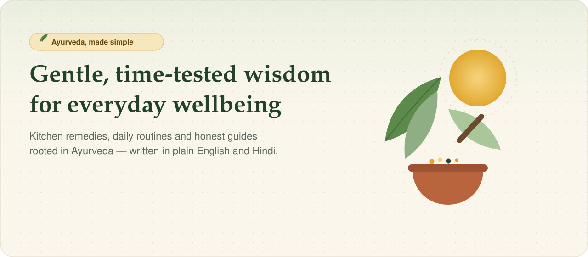
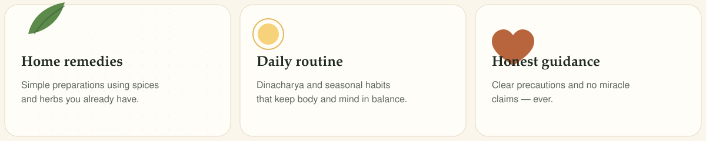
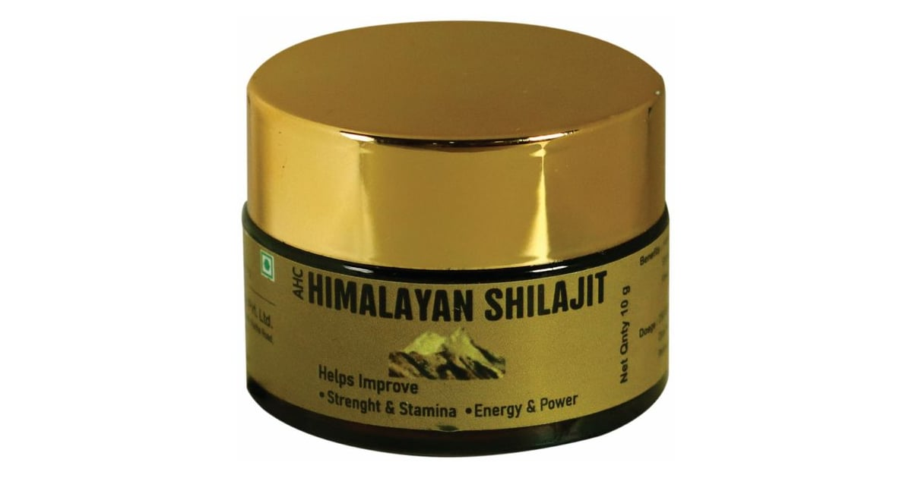

<div align="center">

<a href="https://allayurvedics.in/en">
  
</a>

### Everyday Ayurveda for a healthier, calmer life

Kitchen remedies, daily routines and honest guides — in English and Hindi.

<p>
  <a href="https://allayurvedics.in/en"></a>
  <a href="https://allayurvedics.in/en/remedies"></a>
  <a href="https://allayurvedics.in/en/articles"></a>
  <a href="https://allayurvedics.in/en/products"></a>
  <a href="https://allayurvedics.in/en/about"></a>
  <a href="https://allayurvedics.in/hi"></a>
</p>



<p>
  <a href="https://allayurvedics.in/en/remedies"></a>
  <a href="https://allayurvedics.in/en/articles"></a>
  <a href="https://allayurvedics.in/en/lp/7-day-morning-routine"></a>
</p>



</div>

## Browse by what you need

<p>
  <a href="https://allayurvedics.in/en/remedies?category=digestion"></a>
  <a href="https://allayurvedics.in/en/remedies?category=skin"></a>
  <a href="https://allayurvedics.in/en/remedies?category=hair"></a>
  <a href="https://allayurvedics.in/en/remedies?category=immunity"></a>
  <a href="https://allayurvedics.in/en/remedies?category=cold-cough"></a>
  <a href="https://allayurvedics.in/en/remedies?category=sleep-stress"></a>
  <a href="https://allayurvedics.in/en/remedies?category=joints"></a>
  <a href="https://allayurvedics.in/en/remedies?category=weight"></a>
  <a href="https://allayurvedics.in/en/remedies?category=diabetes-support"></a>
  <a href="https://allayurvedics.in/en/remedies?category=womens-health"></a>
  <a href="https://allayurvedics.in/en/remedies?category=oral-care"></a>
  <a href="https://allayurvedics.in/en/remedies?category=heart-bp"></a>
  <a href="https://allayurvedics.in/en/remedies?category=herbs"></a>
  <a href="https://allayurvedics.in/en/remedies?category=wellness"></a>
</p>

Popular guides: [Hair fall](https://allayurvedics.in/en/home-remedies/hair-care) · [Skin care](https://allayurvedics.in/en/home-remedies/skin-care) · [Stomach](https://allayurvedics.in/en/home-remedies/stomach-problems) · [Cold & cough](https://allayurvedics.in/en/home-remedies/cold-and-cough) · [Joint pain](https://allayurvedics.in/en/home-remedies/joint-pain) · [Weight](https://allayurvedics.in/en/home-remedies/weight-loss) · [Women's health](https://allayurvedics.in/en/home-remedies/womens-health) · [Immunity](https://allayurvedics.in/en/home-remedies/immunity)

## Featured remedies

Popular, easy-to-make remedies from the Ayurvedic kitchen. Open a card, then read the full method on the site.

<table>
  <tr>
    <td width="33%" valign="top">
      <details>
        <summary><b><a href="https://allayurvedics.in/en/remedies/ginger-lemon-appetiser">Ginger–lemon appetiser</a></b></summary>
        A tiny bite of fresh ginger with lemon and rock salt before lunch, to wake up a sluggish appetite.<br>
        <sub>5 min · Digestion</sub>
      </details>
    </td>
    <td width="33%" valign="top">
      <details>
        <summary><b><a href="https://allayurvedics.in/en/remedies/cumin-coriander-fennel-tea">Cumin–coriander–fennel tea</a></b></summary>
        A mild seed tea sipped through the day, often used for bloating and a heavy feeling after meals.<br>
        <sub>10 min · Digestion</sub>
      </details>
    </td>
    <td width="33%" valign="top">
      <details>
        <summary><b><a href="https://allayurvedics.in/en/remedies/spiced-buttermilk-takra">Spiced buttermilk (takra)</a></b></summary>
        Thin, freshly mixed buttermilk with roasted cumin — a light drink Ayurveda praises with lunch.<br>
        <sub>5 min · Digestion</sub>
      </details>
    </td>
  </tr>
  <tr>
    <td valign="top">
      <details>
        <summary><b><a href="https://allayurvedics.in/en/remedies/besan-turmeric-ubtan">Besan–turmeric ubtan</a></b></summary>
        Gram flour, a pinch of turmeric and curd. The traditional cleansing paste used before festivals.<br>
        <sub>5 min · Skin</sub>
      </details>
    </td>
    <td valign="top">
      <details>
        <summary><b><a href="https://allayurvedics.in/en/remedies/coconut-curry-leaf-hair-oil">Coconut & curry-leaf hair oil</a></b></summary>
        Coconut oil gently warmed with fresh curry leaves. A family favourite for the scalp.<br>
        <sub>15 min · Hair</sub>
      </details>
    </td>
    <td valign="top">
      <details>
        <summary><b><a href="https://allayurvedics.in/en/remedies/golden-turmeric-milk">Golden turmeric milk</a></b></summary>
        Warm milk with turmeric, a pinch of black pepper and a little ghee. India's bedtime comfort cup.<br>
        <sub>10 min · Immunity</sub>
      </details>
    </td>
  </tr>
</table>

<p align="right"><a href="https://allayurvedics.in/en/remedies"><b>View all remedies →</b></a></p>

<div align="center">

<a href="https://allayurvedics.in/en/subscribe">
  
</a>

</div>

## Latest articles

Deeper reads on routines, herbs and how to use them safely.

| | | |
|---|---|---|
| **[Shilajit benefits](https://allayurvedics.in/en/articles/shilajit-benefits)** What Ayurveda traditionally uses it for — strength, stamina and energy — and the honest limits. | **[How to take shilajit resin](https://allayurvedics.in/en/articles/how-to-take-shilajit-resin)** Dose, timing and the right way to dissolve a rice-grain amount in warm water or milk. | **[How to spot original shilajit](https://allayurvedics.in/en/articles/how-to-identify-original-shilajit)** Home checks and what to look for on the label before you buy. |

Also worth opening: [Dinacharya, a daily routine you can keep](https://allayurvedics.in/en/articles/dinacharya-ayurvedic-daily-routine) · [The three doshas](https://allayurvedics.in/en/articles/three-doshas-vata-pitta-kapha) · [Full shilajit guide](https://allayurvedics.in/en/shilajit)

<p align="right"><a href="https://allayurvedics.in/en/articles"><b>View all articles →</b></a></p>

## Featured in the shop

Now available from All Ayurvedics. The site calculates the price — this page only introduces the jar.

<table>
  <tr>
    <td width="280" valign="middle">
      <a href="https://allayurvedics.in/en/products/himalayan-shilajit-resin-10g">
        
      </a>
    </td>
    <td valign="middle">
      <a href="https://allayurvedics.in/en/products/himalayan-shilajit-resin-10g"><b>Himalayan Shilajit Resin</b></a> · Adamya Herbals<br>
      Mineral-rich resin, traditionally used to support strength, stamina and energy. 10 g jar.<br><br>
      <b>₹499</b> · MRP ₹799<br><br>
      <a href="https://allayurvedics.in/en/products/himalayan-shilajit-resin-10g"></a>
      <a href="https://allayurvedics.in/en/shilajit"></a>
    </td>
  </tr>
</table>

<div align="center">

<a href="https://allayurvedics.in/en/enquiry">
  
</a>

<p>
  <a href="https://allayurvedics.in/en/enquiry"></a>
  <a href="https://wa.me/919560814623"></a>
  <a href="mailto:hello@allayurvedics.in"></a>
</p>

</div>

---

<details>
<summary><b>हिन्दी में पढ़ें</b> — वही मुखपृष्ठ, हिन्दी में</summary>

<br>

**रोज़ की सेहत के लिए सदियों से परखा हुआ ज्ञान**

आयुर्वेदिक रसोई के आसान नुस्खे, दिनचर्या और ईमानदार मार्गदर्शन — साफ़ हिन्दी और अंग्रेज़ी में, ताकि पूरा परिवार इस्तेमाल कर सके।

- [नुस्खे देखें](https://allayurvedics.in/hi/remedies)
- [लेख पढ़ें](https://allayurvedics.in/hi/articles)
- [उत्पाद](https://allayurvedics.in/hi/products/himalayan-shilajit-resin-10g)
- [मुफ़्त 7-दिन की सुबह की दिनचर्या](https://allayurvedics.in/hi/lp/7-day-morning-routine)
- [पूछताछ भेजें](https://allayurvedics.in/hi/enquiry)
- [न्यूज़लेटर](https://allayurvedics.in/hi/subscribe)

तीन बातें जो साइट हर पेज पर रखती है: **घरेलू नुस्खे**, **दिनचर्या**, और **ईमानदार सावधानी** — चमत्कार के दावे नहीं।

</details>

<details>
<summary><b>Open the rest of the site</b></summary>

<br>

| Explore | Company | Legal |
|---|---|---|
| [All remedies](https://allayurvedics.in/en/remedies) | [About](https://allayurvedics.in/en/about) | [Privacy](https://allayurvedics.in/en/privacy) |
| [Home remedies by topic](https://allayurvedics.in/en/home-remedies) | [Contact](https://allayurvedics.in/en/enquiry) | [Terms](https://allayurvedics.in/en/terms) |
| [Articles](https://allayurvedics.in/en/articles) | [Create an account](https://allayurvedics.in/en/register) | [Medical disclaimer](https://allayurvedics.in/en/disclaimer) |
| [Products](https://allayurvedics.in/en/products) | [Log in](https://allayurvedics.in/en/login) | |
| [Shilajit guide](https://allayurvedics.in/en/shilajit) | | |
| [Free morning guide](https://allayurvedics.in/en/lp/7-day-morning-routine) | | |

</details>

<details>
<summary><b>Developers</b> — run the Next.js site locally</summary>

<br>

Bilingual Next.js 16 storefront. Content, checkout and auth already live in this repo. Setup, environment variables and the Phase 1 security notes are documented separately — do not commit secrets.

```bash
npm install
npm run dev
```

Open [http://localhost:3000](http://localhost:3000). Production canonical is [https://allayurvedics.in](https://allayurvedics.in).

| | |
|---|---|
| Stack | Next.js 16, React 19, TypeScript, Tailwind CSS 4, Zod |
| Languages | English (`/en`) and Hindi (`/hi`) |
| Commands | `npm run dev` · `npm run build` · `npm run lint` · `npm run typecheck` |
| Docs | [SETUP.md](SETUP.md) · [Phase 1 security](docs/phase-1-security.md) · [.env.example](.env.example) |

</details>

<p align="center">
  <sub>
    Content on <a href="https://allayurvedics.in">allayurvedics.in</a> is for general information only and is not a substitute for professional medical advice.
    Consult a qualified practitioner, especially if you are pregnant, nursing, on medication, or have a medical condition.
    <br>
    © 2026 All Ayurvedics
  </sub>
</p>
